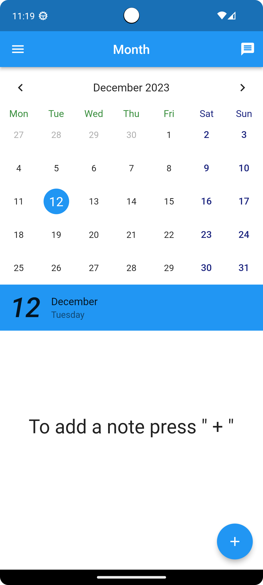
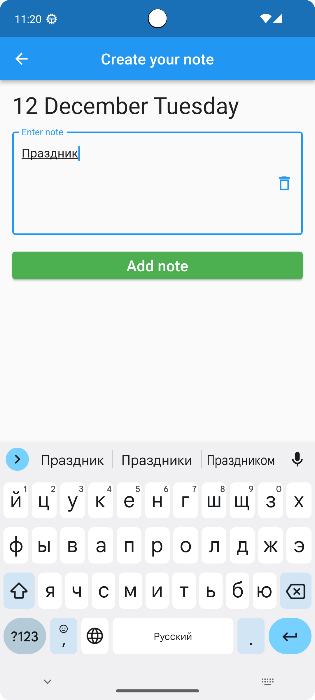
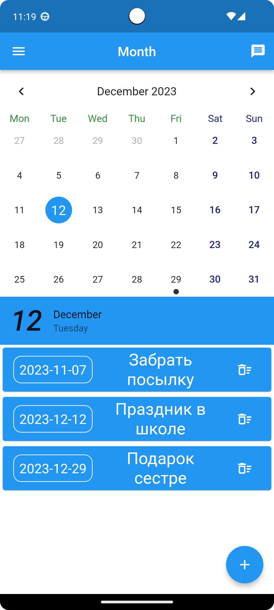
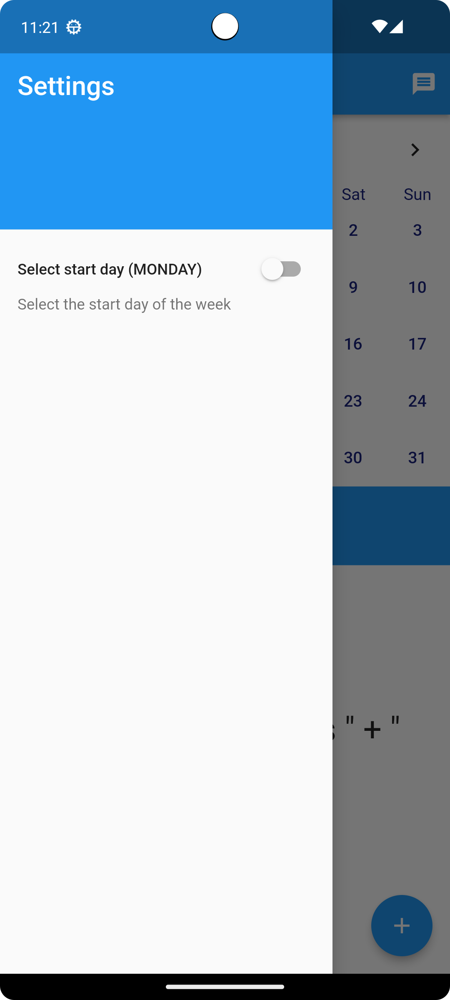

# calendar_app

# Описание проекта

**Проект самой простой записной книжки с календарем, который создавался с целью закрепления знаний пакета BloC и пакета SQL, фрэймворк Flutter.**

|            Главное меню             |            Создание записи             |
|:-----------------------------------:|:--------------------------------------:|
|  |  |

|               Созданные записи                |           Настройка начала недели           |
|:---------------------------------------------:|:-------------------------------------------:|
|  |  | 